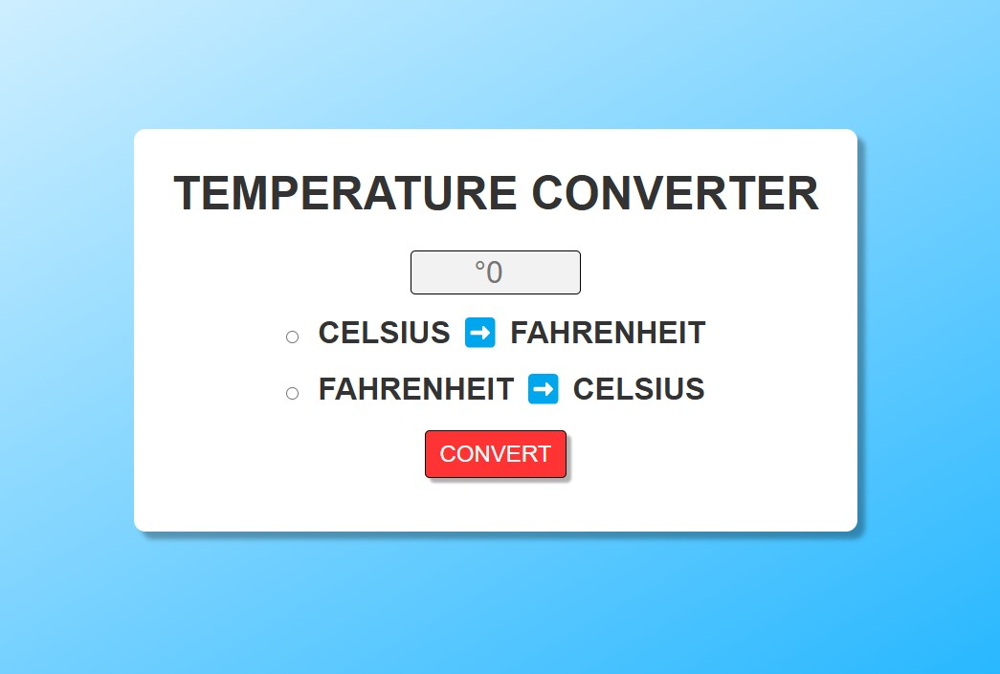

# Temperature Converter

## Project Summary

The Temperature Converter is a simple yet effective web application that allows users to convert temperature values between Fahrenheit and Celsius. Built using HTML, CSS, and JavaScript, this tool provides instant feedback with a user-friendly interface and intuitive controls.

This project reinforces key front-end development skills including DOM manipulation, conditional logic, form handling, event-driven programming, and responsive design. It is ideal for demonstrating interactive form processing and conversion logic in a clean, responsive layout optimized for mobile and desktop environments.

## Table of Contents

- [Mock Up](#mock-up)
- [Instructions](#instructions)
- [Key Features](#key-features)
- [Deployed Aplication](#deployed-application)

## Mock-Up

The following image shows the web application's appearance:

## Instructions

### 1. Launch the Application:

- Open `index.html` in any modern browser.

- Or visit the deployed link in the Deployed Application section.

### 2. Convert a Temperature:

- Enter a numerical value into the input box.

- Select a conversion type using one of the radio buttons:

  - Fahrenheit ➡️ Celsius

  - Celsius ➡️ Fahrenheit

- Click the CONVERT button.

### 3. View Results:

- The converted temperature will be displayed with the appropriate unit label.

## Key Features

**Live Result Display:** Instant calculation and clear output after form submission.

**Input Validation:** Prompts the user to select a conversion type before performing the calculation.

**Responsive Design:** Optimized layout for all screen sizes including mobile and ultra-wide displays.

**User-Friendly Interface:** Simple form structure and labeled options ensure a smooth user experience.

**Bidirectional Conversion:** Supports both Fahrenheit to Celsius and Celsius to Fahrenheit conversions.

## Deployed Application

[Temperature COnverter](https://gilmerperez.github.io/temperature-converter/)